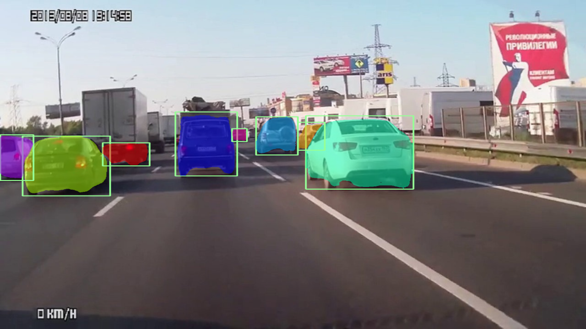
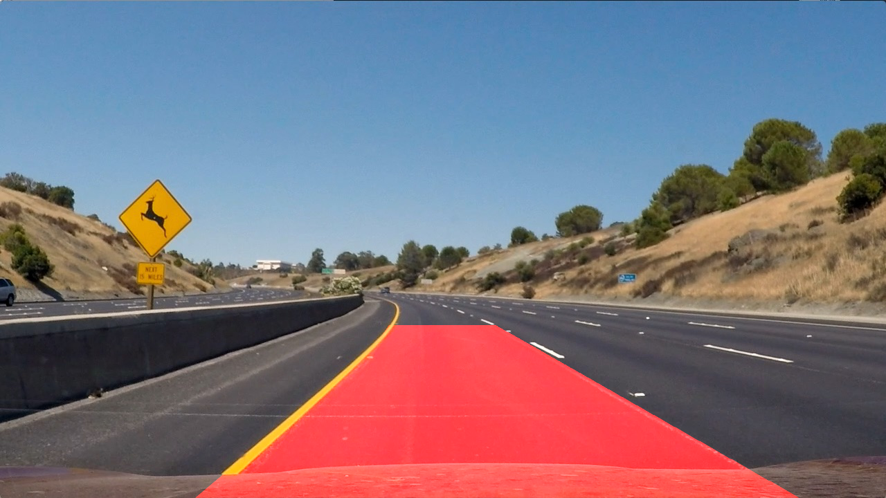
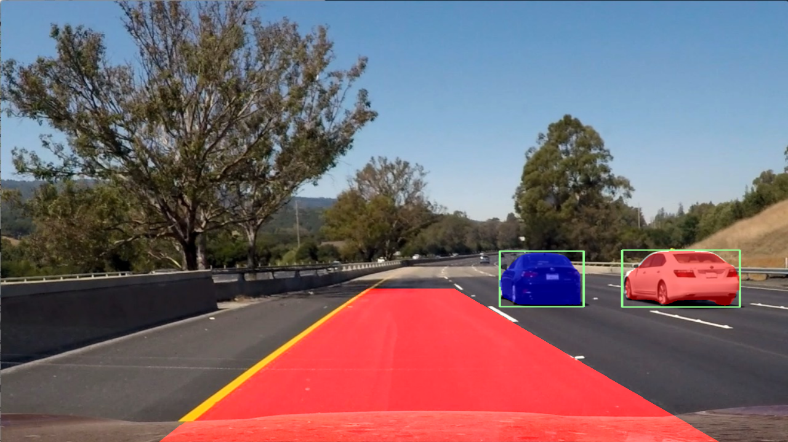

# Vehicle Tracking & Lane Detection
Vehicle Detection using Mask R-CNN and Computer Vision based Lane Detection

I've implemented the [Mask R-CNN](https://arxiv.org/abs/1703.06870) using Keras and TensorFlow.
The model detects vehicles in the image frame using segmentation masks with the pretrained weights trained on COCO dataset; the lane detection is done using sobel filter.

### Mask R-CNN output on a road scene:

Final Video GIF:

### Land Identification output:

  

Final combined output:

  

Download the pretrained weights [here](https://drive.google.com/open?id=1dNi9Ny1h9KBMj_3mocMQNapeEwgeERlz) and place it in the current working directory. Run main.py specifying the input image path. It can be applied with video files using moviepy and calling process_video() function.

